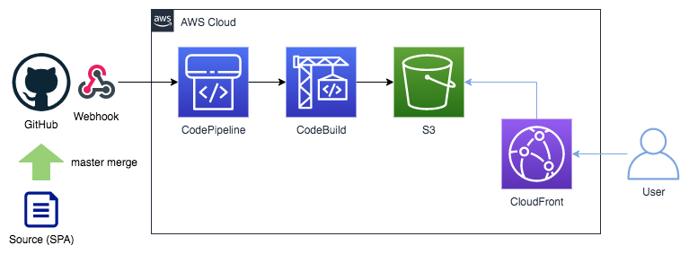

## やれること
- S3で静的コンテンツをCloudFrontを経由して配信する一連の流れをAWSに構築する
- GitHub上の特定リポジトリへマージが発生した時に自動でデプロイを走らせる



## 実行手順
1. GitHubのデプロイ対象に[buildspec.yaml](https://docs.aws.amazon.com/ja_jp/codebuild/latest/userguide/build-spec-ref.html)を作成する
  - buildspec.yamlの例は[こちら](https://github.com/gitkado/book-clipper-frontend/blob/master/buildspec.yaml)
2. template.yamlのParametersを任意の値に設定する
3. 以下どちらかの方法でCFnを実行する
  - CFnコンソール上で実行
  - Cloud9などのターミナル上で以下のコマンドを実行

```sh
aws cloudformation deploy --template template.yaml --stack codepipeline-s3-cfn --capabilities CAPABILITY_IAM
```

## 注意点
- 実行手順1で作成するbuildspec.yamlではCloudFrontのキャッシュを更新する必要がある
